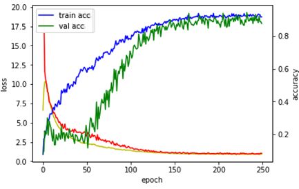

# Face Recognition

### Face Detection
- Use Pre-trained weight([link1](https://github.com/Team-Neighborhood/awesome-face-detection/), [link2](https://github.com/opencv/opencv/tree/master/samples/dnn))

### Face Classification
- Reduce VGG16 -> VGG8 due to lack of VRAM
- Use Google Colaboratory (spent 1882seconds)

### Result & Performance

- Face Detection : 91.44% (avg 93ms in CPU)
- Face Classification : 90.29% (avg 94ms in CPU)
- Overfitted. so this doesn't work well in video.

